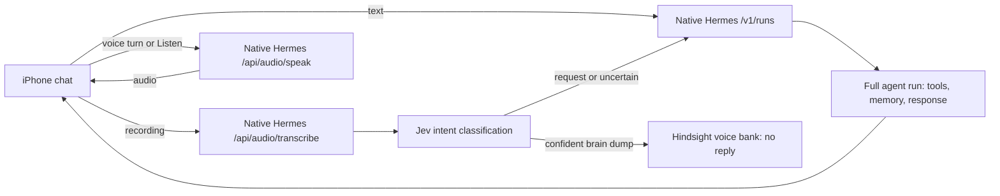

# Hermes

Native iPhone chat client for [Hermes Agent](https://github.com/NousResearch/hermes-agent). This repository maintains the iOS app and an optional APNs reply-notification service; no Hermes plugin or native source patch is required.

The iOS app is named **Hermes** (`com.artbred.hermesapp`), distinct from the preserved legacy **Hermes Voice** (`com.artbred.hermesvoice`). Legacy chats and credentials remain separate; the Xcode target and scheme are still `HermesVoice`.

- Create chats, switch between previous conversations, and continue their native Hermes sessions. Different chats run independently; an approval or file import in one chat does not disable another.
- A reference-style new-chat screen: clear canvas, black-to-blue/indigo gradient in dark mode, and a broad rounded composer above the keyboard. Opening a new/empty chat focuses the composer by default. The left **+** opens file upload; the right waveform records an audio message, and Send appears alongside it when there is text or an attachment. The sidebar button and real model selector sit together in the header; New Chat remains only at top right. The gradient follows the keyboard-avoiding viewport and covers the keyboard's rounded corners. Short transcripts top-align, with no floating Latest/jump-to-bottom button.
- Add files with the composer's **+** button. Preview or remove them before sending; Hermes receives actual uploaded files and can inspect them with its native tools. Attachment drafts survive relaunch; text drafts are retained when switching chats within the app.
- New agent turns use the provider/model explicitly selected in the header, not an implicit Hermes server default. The picker shows up to five eligible choices, prioritizing this chat and recent local selections before the server's featured inventory. The last explicit preference persists for new chats; existing chats retain their own choice. First use requires choosing a model. Each queued message and prepared admission freezes that identity so retries cannot silently switch models.
- Voice messages use Hermes STT, then Jev automatically routes the transcript: requests/questions become full agent turns with spoken replies; high-confidence thoughts/diary entries are saved to the Hindsight `voice` bank without an agent run, assistant reply, or TTS. Messages with attached files always go to the agent rather than silent brain-dump storage.
- Your recorded voice messages show a static **Audio message** indicator with selectable transcription underneath, without original-recording playback, seek, or share controls. The recording is retained for transcription/retry; AI reply speech and **Listen** remain available.
- Text-message replies stay silent. Tap **Listen** on any reply to generate and play its audio; generated audio is cached on the phone.
- While reply audio is playing, the composer's recording control becomes **Stop audio** in the same slot. Tapping it pauses without losing the resume position and restores the waveform recording control. The reply's inline **Pause/Resume audio** stays synchronized; inline resume brings the composer stop control back without another synthesis request.
- Jev selects the spoken reply's language before uncached speech: English uses the general Settings voice (Sarah by default), Russian uses **Рената Литвинова** (`c35aeeb5f9c145199fbffdbc2ef8ed95`), and unsupported/uncertain/unavailable classification falls back to the general voice. The text-answer model is unchanged; all synthesis remains paid Fish **2.1 Pro**.
- Agent replies render as inline mobile HTML interfaces: cards, tables, task lists, collapsible details, and local interactive controls. Source links are underlined and open in an in-app browser. Older Markdown replies remain readable; speech, copying, and search use human text rather than markup.
- **New Voice Chat** in Shortcuts/Siri/Action Button opens the app, creates a new chat, and records. Invoke it again while recording to send that take without creating another chat. The in-app microphone records into the current chat.
- Recording has one **Send** button; tapping elsewhere inside the app immediately discards the recording and consumes that tap.
- Conversation titles are generated asynchronously by the auxiliary model, not copied from the opening sentence. Message headers/timestamps are omitted; an assistant-side activity indicator shows the current processing step.



## Setup

Build/install instructions and app behavior: [`ios/README.md`](ios/README.md).
Native HTTP contract and deployment boundaries: [`docs/API.md`](docs/API.md).

Open Settings from the left menu; it uses native push/back navigation, not a bottom sheet. Enter **one server URL and one API token**. Both are stored in Keychain. **Test connection** checks chat, voice, files, routing, titles, and memory storage without invoking a model or writing data.

The deployment uses `https://hermes.sashakuzina.com` and `API_SERVER_KEY` from `~/.hermes/.env` on `kuzin`. Every app request uses that Bearer token. Dashboard and provider credentials remain on the server behind authenticated, narrowly scoped proxy routes.

### Shared desktop, phone, and terminal sessions

`kuzin`, default profile, owns the canonical `/root/.hermes/state.db`. The desktop's existing SSH tunnel (`http://127.0.0.1:19119` → `kuzin:127.0.0.1:9119`) and the phone's public HTTPS URL reach that same store. They intentionally use different credentials: the desktop's dashboard token stays on the Mac; the phone keeps its scoped native API token in Keychain. Do not point the desktop at the phone-only public endpoint or expose desktop administration routes under the mobile token.

The phone imports `api_server`, `desktop`, and `cli` sessions and periodically refreshes history while active, as well as supporting manual Refresh. It continues the native session ID, follows compression aliases, and includes pre-compression display history. Existing local audio, attachments, drafts, failed attempts, and brain dumps are retained. Empty, message-less chats stay out of Recents/search. A topic title is generated from the first submitted user text or transcription in parallel with the agent, shown locally immediately, and published once native session identity arrives; failed publications retry after reopening. Shared session titles and subsequent desktop renames come from the server.

Desktop groups phone-origin sessions under its **API** sidebar section, which may be collapsed; desktop/CLI-origin sessions remain under **Sessions**. This grouping is provenance, not separate storage.

For occasional terminal use, install the explicit launcher without replacing local `hermes`:

```sh
chmod +x hermesapp/scripts/hermes-shared
mkdir -p ~/.local/bin
ln -s "$PWD/hermesapp/scripts/hermes-shared" ~/.local/bin/hermes-shared
hermes-shared
hermes-shared --resume <native-session-id>
hermes-shared sessions list
```

The launcher requires the existing SSH alias `kuzin`. It runs native Hermes with `HERMES_HOME=/root/.hermes` and `--profile default`, quotes arguments for the remote shell, and allocates a terminal only for interactive stdin. Tools and working directories are on the VPS, not the Mac. Ordinary Mac-local `hermes` remains available but uses a separate store; it is not replicated. Do not override the shared launcher's profile if you want the same sessions as desktop and phone.

On this Mac, interactive zsh maps `hermes` to the shared launcher with `alias hermes='hermes-shared'` in `~/.zshrc`. New shells load it automatically; run `source ~/.zshrc` in an existing shell. The unaliased Mac-local executable remains available explicitly as `~/.local/bin/hermes`.

Only server-owned conversation history and titles are shared. Recordings, downloaded speech, unsent drafts, attachments' local previews, and silent diary-only chat entries remain device-local; their saved memory still lives in Hindsight. Removing a chat on the phone hides its whole native compression lineage on that phone; it does not delete the server conversation or other clients' copies.


## Hermes configuration

Enable Hermes's native `api_server` platform and set `API_SERVER_KEY`, `API_SERVER_HOST`, and `API_SERVER_PORT` in the Hermes environment. Keep TLS/authentication in front of it. Enable the native dashboard backend for its speech routes, but **do not expose its administrative API** to the phone's public hostname.

The phone uses native Hermes transcription and a narrowly scoped authenticated Fish speech endpoint. Native Hermes and mobile retain Fish Official **Sarah** (`933563129e564b19a115bedd57b7406a`) as the general voice with explicitly paid **2.1 Pro** (`s2.1-pro`). Jev selects the Russian voice for confident Russian replies and the general voice for English or fallback. The canonical implementation now belongs to the real [`fish-language-tts`](../plugins/fish-language-tts/) provider plugin; `speech/` is the mobile HTTP adapter and installs its shared `hermes_fish_speech` package. This repository migration has not been installed on active hosts: `kuzin` still runs the previously deployed command/service implementation until explicitly authorized. Mobile Settings → Reply voice changes the phone's general voice without changing the shared native default. Provider keys stay server-side. Language-aware mobile playback requires build 30; installed build 29 keeps explicit voice synthesis until the app is updated. For the installed local-command STT path, explicitly set:

```yaml
stt:
  enabled: true
  provider: local_command
  local:
    language: auto
```

An empty language setting on this native path can fall back to English. Fish transcription remains on the existing native route. The plugin's shared package implements paid speech/language routing; `speech/` supplies the authenticated mobile adapter, preserving the same URL/API token and private administrative boundary. See [`docs/API.md`](docs/API.md#native-speech) for provider installation, deferred cutover, and cache identity details.

## Delivery and persistence

Chats, messages, recordings, and synthesized replies live in Application Support under `Chats/`. A message and its request identity are saved before network submission. Native run IDs are persisted; relaunching the app resumes status retrieval rather than creating a second run. Server conversation context stays in Hermes.

The native voice flow is multiple requests, not an atomic audio-and-run endpoint. iOS grants only limited background execution; if it suspends the app before transcription/run submission finishes, reopen the app to resume. An accepted run continues on Hermes without the phone. Failed messages show an error and a Retry control. Retrying a terminal run is an explicit new attempt and can repeat actions already performed by the agent. Native idempotency is retention-bounded (24 hours on the configured server), not a permanent exactly-once guarantee.

While processing, Hermes shows its activity alongside the streamed reply. The composer's square Stop control requests interruption and shows **Stopping…** until the server confirms the result; it also handles a stop requested during submission. Stop intent survives relaunch. Completed actions are not rolled back.

Pending approvals show **Review request** instead of automatically blocking navigation. Close or swipe away the review to keep using another chat; that does not approve, deny, or stop the pending request. The chat list shows which conversations are in progress or need approval. One outstanding turn per local chat is intentional; native requests targeting the same conversation also serialize. The VPS admission limit is 10 concurrent API runs, so server capacity or provider limits can still delay/reject additional work.

Reply notifications use server-side APNs delivery, not phone polling. With notification permission, a push-enabled signing profile, and the notification service configured, a completed reply alerts the phone while Hermes is not open. Foreground replies are acknowledged and do not show banners; tapping an alert opens its owning chat. Alerts contain no reply text. The current production deployment is **not enabled** until Apple signing and APNs credentials are supplied; see [`docs/API.md`](docs/API.md#reply-notifications).

## Migration from the diary app

The former `voice-notes` plugin, `/v1/notes` protocol, and dedicated diary tooling have been removed from this repository. Ordinary messages use native Hermes conversations. Automatically detected brain dumps retain the original transcript in the existing Hindsight `voice` bank through its native API, without a custom plugin.

Existing on-device `Outbox/` files and server diary/Hindsight data are not deleted or automatically replayed as agent instructions. Native credentials use separate Keychain entries; set up the new connection once after upgrading. Deleting a chat in the app removes its local copy/audio and hides it from subsequent history imports; it does not delete the Hermes session.

## Development

```sh
cd ios
xcodegen generate
xcodebuild -scheme HermesVoice -destination 'platform=iOS Simulator,name=iPhone 17 Pro' test
```

The Swift Testing suite covers native protocol boundaries, speech-mode behavior, durable accepted-run recovery, and storage failure handling. See the iOS guide for device installation and verification details.

## License

MIT
